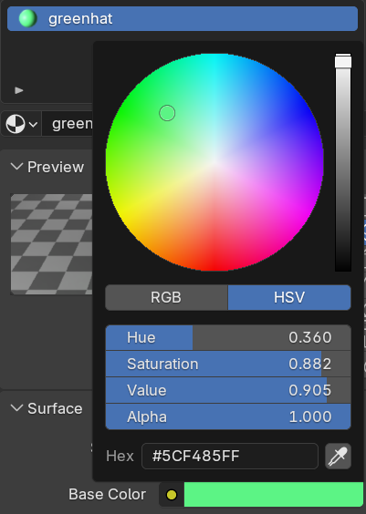

## Colour the hat

--- task ---

Open the snowman you created in the [Snowman](https://projects.raspberrypi.org/en/projects/blender-snowman){:target="_blank"} project. 

If you don't have a snowman, you can [download the starter project](resources/colour-a-snowman.blend).

--- /task ---

To colour the snowman, you need to add some **materials** to the model.

--- task ---

Select the hat.

--- /task ---

--- task ---

Go to the **Material Properties** tab on the right menu panel.

You might need to scroll the menu down to see it.

--- /task ---

--- task ---

Add a new material by clicking **New**.

--- /task ---

--- task ---

Name the material 'greenhat' by typing the name in the box.

--- /task ---

--- task ---

Select a green color from the **Base Color** menu to colour your rocket blue.

--- /task ---

The colour might be too bright. 

You can decrease the amount of intensity.

--- task ---

Select **Base Color** again and lower the intensity slider on the right towards the black colour. 

You'll see the green getting darker.

--- /task ---

--- task ---

Click 'Render Image' in the 'Render' menu to see what your snowman looks like so far.

**Note**: This may take some time.

--- /task ---

You can see that the snowman now has a green hat.

--- task ---

Exit the render view.

--- /task ---

--- task ---

Select the 'Material Preview' or 'Rendered View' option from the Viewport Shading options to see the colour on the snowman in the 3D View.

--- /task ---

--- save ---