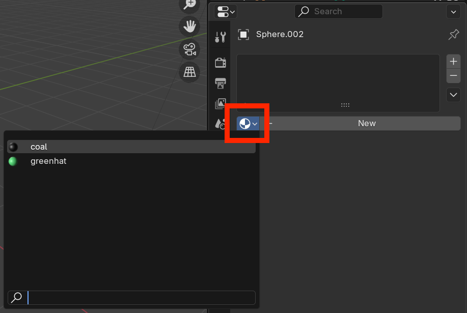

## Colour the eyes and buttons

Re-use the coal material to colour the other eye and the buttons.

--- task ---

Select the other eye.

--- /task ---

--- task ---

Go to the **Material Properties** tab on the right menu panel and click on the **Browse Material** drop-down menu to the left of the **New** button.

--- /task ---

--- task ---

Select the 'coal' material you created earlier.

--- /task ---

--- task ---

Repeat this process for each of the snowman's buttons.

--- /task ---

--- save ---