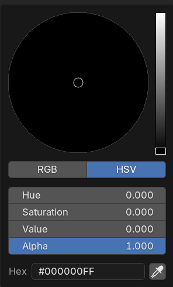

## Colour the nose

--- task ---

Select the nose. 

--- /task ---

--- task ---

Add a new material by clicking **New**.

--- /task ---

--- task ---

Name the material 'coal'.

--- /task ---

--- task ---

Select a green color from the **Base Color** menu to colour your rocket blue.

--- /task ---

--- task ---

Select **Base Color**. 

--- /task ---

There is no black on the colour palette. 

--- task ---

Drop the intensity slider on the right until you get to black.

--- /task ---

--- save ---