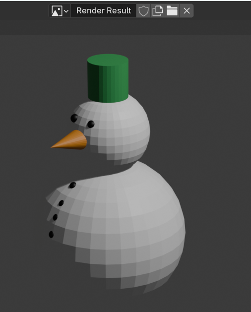

## Challenge

--- task ---

Colour the snowman's nose orange.

You'll need to create a new material and select a colour for it.

--- /task ---

--- task ---

Colour the snowman's head and body white.

To make a white material, drag the intensity slider to the top.

--- /task ---

--- task ---

Click 'Render Image' in the 'Render' menu to see your finished snowman.

--- /task ---

--- save ---
