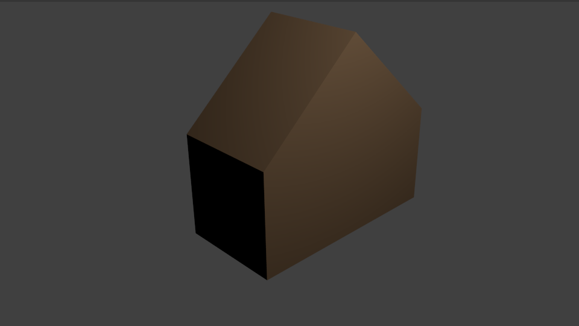

## What can you do now?

If you are following the [Blender for beginners](https://projects.raspberrypi.org/en/pathways/blender-basics) pathway, you can move on to the [Block house](https://projects.raspberrypi.org/en/projects/next-project/blender-block-house) project. In this project, you will create creating a simple house from a single block.

--- print-only --- 

--- /print-only ---

--- no-print ---

  <iframe class="responsive-embed__iframe" src="https://sketchfab.com/models/79f08731ff7848f48e09fbe473ee563b/embed" frameborder="0" allowvr allowfullscreen mozallowfullscreen="true" webkitallowfullscreen="true"></iframe>

--- /no-print ---
