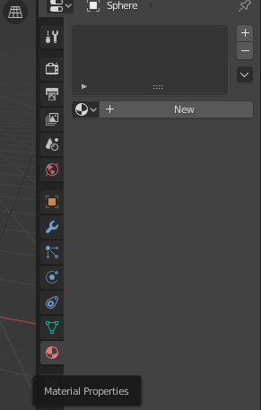
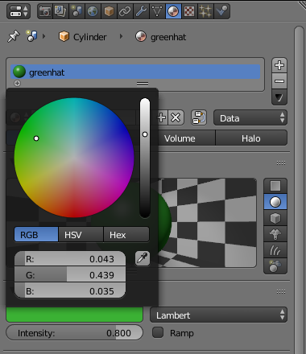

## टोपी में रंग भरें

यदि आप [स्नोमैन](https://projects.raspberrypi.org/hi-IN/projects/blender-snowman){:target="_blank"} संसाधन पूरा कर चुके हैं तो आप उस स्नोमैन के साथ शुरू करेंगे जिसे आपने तैयार किया है। यदि आपके पास स्नोमैन नहीं है, तो आप [प्रारंभक परियोजना डाउनलोड](resources/snowman.blend) कर सकते हैं।

स्नोमैन के सिर पर एक टोपी है। आइए इसे हरा बनाने की कोशिश करते हैं।

+ <kbd>F12</kbd>दबाकर (या यदि आप Mac का उपयोग कर रहे हैं तो <kbd>FN + F12</kbd> दबाकर) छवि प्रस्तुत करें।

यदि आप यह देखें कि कैमरे को क्या दिखता है, तो स्नोमैन पूरी तरह से ग्रे दिखता है। उदाहरण के लिए:

स्नोमैन को रंगने के लिए, आपको मॉडल में कुछ **सामग्री** जोड़ने की आवश्यकता होगी।

+ प्रस्तुत दृश्य से बाहर निकलने के लिए <kbd>ESC</kbd> दबाएँ।

+ टोपी का चयन करें, फिर दाईं ओर के पैनल पर मेनू से **Material Properties** आइकन का चयन करें।

+ **New** बटन पर क्लिक करके कोई नई सामग्री जोड़ें।

+ बॉक्स में नाम टाइप करके सामग्री को 'greenhat' नाम दें।

+ नीचे, **Base Color** पर जाएँ और सफेद बॉक्स पर क्लिक करें। एक रंग का पैलेट दिखाई देगा, जहाँ आप कोईअच्छा हरा रंग चुन सकते हैं।

रंग के विकल्प आपकी पसंद के हिसाब से बहुत चमकीले हरे रंग लग सकते हैं। यदि आप कोई गहरा हरा रंग पसंद करते हैं, तो आप इसके गहरेपन की मात्रा को कम कर सकते हैं।

+ रंगीन बॉक्स पर क्लिक करके फिर से **Base Color** का चयन करें। रंग के पैलेट पर दाईं पट्टी में डॉट को काले रंग की तरफ नीचे करें। आप देखेंगे कि हरा रंग गहरा होता जा रहा है।

+ यह देखने के लिए अपनी छवि को प्रस्तुत करें कि यह कैसी दिखती है।

आप देख सकते हैं कि स्नोमैन की टोपी अब हरी है।

+ दृश्य प्रस्तुति से बाहर निकलें।

+ 3D व्यू में स्नोमैन पर रंग देखने के लिए, **Viewport Shading** बटन क्लिक करें।

