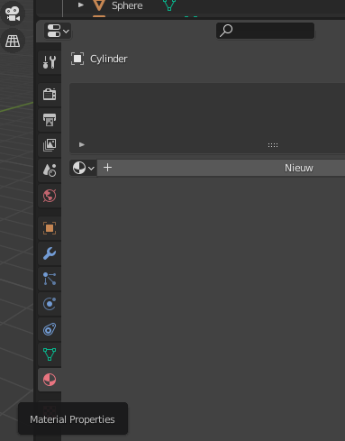
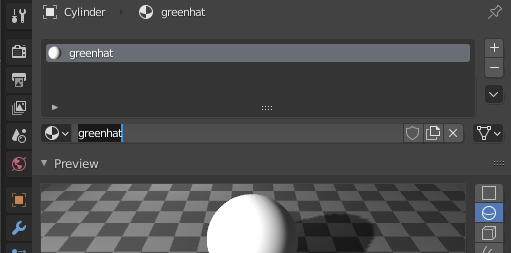
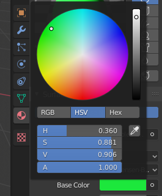

## Kleur de hoed

Je begint met de sneeuwpop die je hebt gemaakt als je het [Sneeuwpop](https://projects.raspberrypi.org/nl-NL/projects/blender-snowman){:target="_blank"} project hebt voltooid. Als je geen sneeuwpop hebt, kun je [het startproject downloaden](resources/snowman.blend).

Op zijn hoofd heeft de sneeuwpop een hoed. Laten we proberen het groen te maken.

+ Render de afbeelding door op <kbd>F12</kbd> te drukken (of <kbd>FN + F12</kbd> als je op een Mac werkt).

Als je kijkt naar wat de camera ziet, ziet de sneeuwpop er helemaal grijs uit. Bijvoorbeeld:

Om de sneeuwpop te kleuren, moet je wat **materials** (materialen) toevoegen aan het model.

+ Druk op <kbd>ESC</kbd> om de renderweergave te verlaten.

+ Selecteer de hoed en selecteer vervolgens het **Material Properties** (materiaaleigenschappen) in het menu in het rechterpaneel.

+ Voeg een nieuw materiaal toe door op de knop **Nieuw** te klikken.

+ Noem het materiaal 'greenhat' door de naam in het vak te typen.

+ Ga hieronder naar **Base Color** (basiskleur) en klik op het witte veld. Er verschijnt een kleurenpalet, waar je een mooie groene kleur uit kunt selecteren.

De kleurkeuzes zien er naar jouw smaak misschien te felgroen uit. Als je liever een donkerder groen hebt, kun je de intensiteit verlagen.

+ Selecteer **Base Color** opnieuw door op het gekleurde veld te klikken. Verplaats de stip in de rechterbalk op het kleurenpalet omlaag naar de zwarte kleur toe. Je zult zien dat het groen donkerder wordt.

+ Render je afbeelding om te zien hoe deze eruitziet.

Je kunt zien dat de sneeuwpop nu een groene hoed heeft.

+ Verlaat de renderweergave.

+ Om de kleur van de sneeuwpop in de 3D-weergave te bekijken, klik je op de knop **Viewport Shading**.

